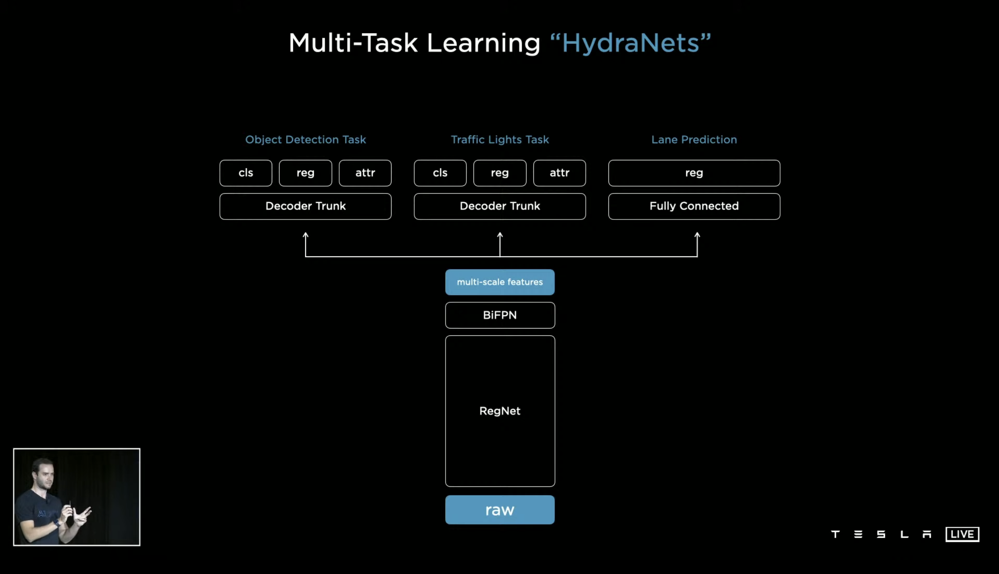

# Tesla-Vision-Stack

From-scratch implementation of the Tesla HydraNet architecture demonstrated on Tesla AI Day, 2021. 

<p align="center">
  
</p>

## Architecture
1. A RegNet (Radosavovic et al. 2020) backbone for feature extraction.
2. A BiFPN (Tan et al. 2020) for efficient multi-scale feature fusion.
3. Task specific heads for object detection, lane prediction, etc.
4. Enables efficient feature sharing, and caching for finetuning individual heads.

<p align="center">
  
</p>

Sincere thanks to Andrej Karpathy and Tesla.

## Usage

### Installation
```
git clone https://github.com/Vinaypnaidu/Tesla-Vision-Stack.git
cd Tesla-Vision-Stack
pip install -e .
```

### Training
```
python train.py --config_path "config.yaml"      
                --data_path "./data/BDD100K"          
                --log_path "./runs/run1/logs"        
                --save_path "./runs/run1/trained_models"
                --lr 1e-4                   
                --batch_size 8
```
### Dataset structure

```
BDD100K
├───images
│   └───100k
│       ├───train
│       └───val
└───labels
    ├───det_20
    │   ├───det_train.json
    │   └───det_val.json
    ├───lane
    │   ├───masks
    │   ├───polygons
    │   └───colormaps
    └───drivable
        ├───masks
        ├───polygons
        └───colormaps
```

### Inference
```
python inference.py --checkpoint_path "hydranet.pth"   
                    --config_path "config.yaml"             
                    --image_folder "path/to/images" 
                    --output_folder "path/to/outputs" 
```

Model weights are available for download [here](https://drive.google.com/file/d/1Fn16_e6WMupVPYH5YB387dVy-UyXGQEG).

## Future Work
1. Implement multi-cam fusion.
2. Implement vector space predictions.
2. Implement the video module for memory.

## References
1. [Tesla AI Day, 2021](https://www.youtube.com/watch?v=j0z4FweCy4M)
1. Ilija Radosavovic, Raj Prateek Kosaraju, Ross Girshick, Kaiming He, Piotr Dollár. "Designing Network Design Spaces". CVPR, 2020.
2. Mingxing Tan, Ruoming Pang, Quoc V. Le. "EfficientDet: Scalable and Efficient Object Detection". CVPR, 2020.
3. Tsung-Yi Lin, Priya Goyal, Ross Girshick, Kaiming He, Piotr Dollár. "Focal Loss for Dense Object Detection". CVPR, 2017.
4. Yu, Fisher and Chen, Haofeng and Wang, Xin and Xian, Wenqi and Chen, Yingying and Liu, Fangchen and Madhavan, Vashisht and Darrell, Trevor. "BDD100K: A Diverse Driving Dataset for Heterogeneous Multitask Learning. CVPR, 2020.
3. https://github.com/BloodAxe/pytorch-toolbelt
4. https://github.com/iVishalr/RegNetX
5. https://github.com/signatrix/regnet
6. https://github.com/signatrix/efficientdet
7. https://github.com/datvuthanh/HybridNets
